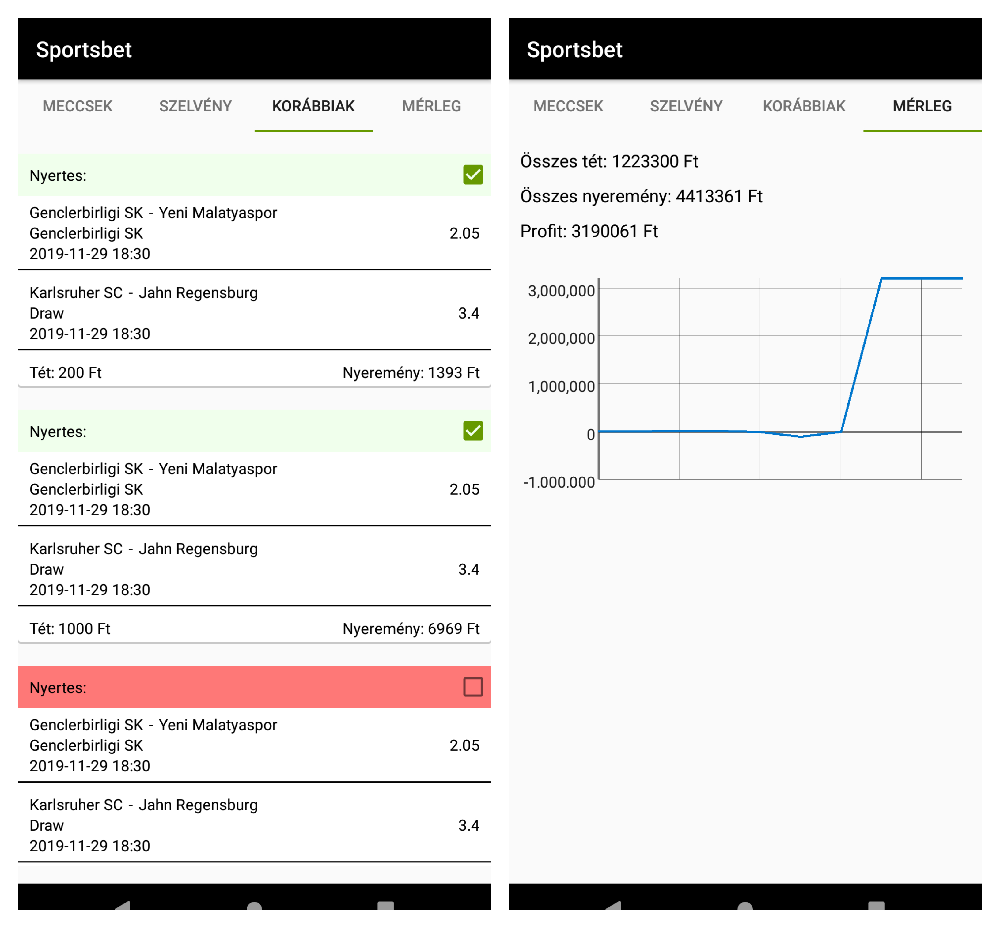

# Sportsbet Android app

Egy sportfogadó alkalmazás kliensoldala. RestAPI-n keresztül lekérdezi az elérhető meccseket, ezeket utána megjeleníti egy listában. Az összeállított meccseket meglehet nézni a szelvényen, ott be lehet állítani a tétet. A szelvényeket el lehet menteni, a régebbi szelvényeket megtekinteni, és az összesített egyenleget megnézni.
Hálózati hívásokra Retrofit-et, adatok tárolására a telefonon Room-ot használ.

Screenshotok:

